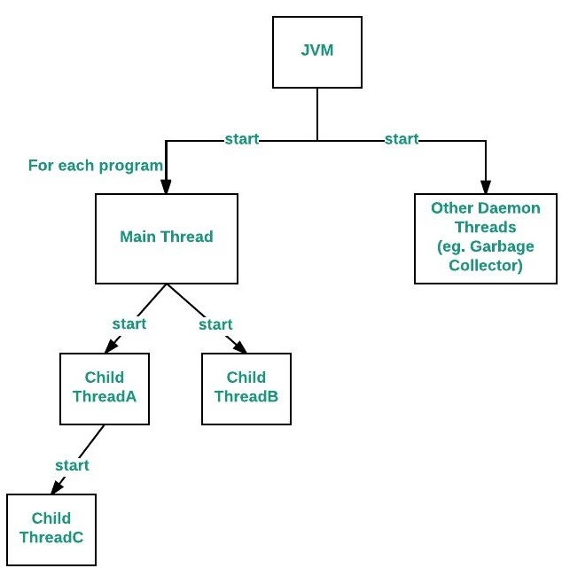

<div class="title-card">
    <h1>Concurrency / Java Threads</h1>
</div>

---

# What is Concurrency?

Studieordning: [Samtidighed](https://katalog.kea.dk/course/3050241/2025-2026).

Concurrency problems arise when multiple processes/threads access shared resources simultaneously. This could lead to potential conflicts and inconsistencies.

We've already seen concurrency at different levels:

**CPU**: Scheduling (scheduling algorithms)

**OS**: Processes

**Databases**: Concurrent access to data and concurrency control mechanisms (transactions, locks, isolation levels)

---

# Threads

We will now look at concurrency at the software level.

Particular in Java which supports multithreading.

A thread is a lightweight sub-process, the smallest unit of processing.

It can run concurrently with other threads within the same program.

---

# Multitasking/Multiprocessing

Multiple processes run independently. Run multiple programs at the same time.

Each process has its own memory space and resources.

A proccess is heavyweight.

---

# Threads in JVM

There are two types of threads in **JVM**:



[Source](https://github.com/FilipVelkovski2001/JAVA_THREADS_EXAMPLE)

Then we can create our own threads. From now on when we say "thread", we mean a user thread.

---

# Multithreading

As opposed to **multiprocessing**.

**Multithreading**: The threads share the same memory space and resources of the process (Java Process). They execute the same byte code instructions.

The JVM gives each thread its own method-call stack. The stack stores local variables, parameters and return addresses. 

Heap memory is shared among all threads! Example of this is static variables and objects created in the heap.

Shared memory means saving memory space and faster context switching between threads.

But the shared memory can lead to problems...

---

# Why Threads?

Obviously, we are about to run into a lot of problems with isolated/shared memory. So why use threads at all?

1. **Responsiveness**: Non-blocking UI in GUI applications. We are left no choice.

2. **Task Delegation**: Offload tasks to separate threads.

3. **Utilization of multi-core processors**: Perform multiple tasks simultaneously.

---

# Threads are Non-deterministic

**Hardware** has a say in how threads are scheduled.

How the **operating system** schedules the threads, the order of execution may vary each time the program is run. Each JVM implementation uses the platform's underlying thread scheduling mechanism.

Even with the above factors being constant, the thread scheduling may still vary due to other factors like system load, CPU availability etc.

Unlike the procedural programming model that you are used to, we can no longer predict the execution order of statements in a multithreaded program.

This will be fun to notice once we run the same code in class.

---

# [Java Synchronization](https://docs.oracle.com/javase/tutorial/essential/concurrency/sync.html)

When multiple threads access shared resources such as fields and objects causing the following problems:

1. **Thread interference**: read-modify-write conflicts, lost updates

2. **Memory consistency errors**: stale data, visibility issues

The solution is *synchronization*.

---

# Let's act out a classic concurrency problem

5 students will be seated around a table.

You will have a plate each.

In between each plate, a fork is placed.

Imagine that there is spaghetti on the plates and you can only dine with both forks.

You are starving. Don't pay attention to others. Be greedy.

*Go ahead and eat*. Bon appétit!


---

# Dining Philosophers Problem

What we just acted out is called the [Dining Philosophers Problem](https://en.wikipedia.org/wiki/Dining_philosophers_problem).

The problem illustrates problems of **Thread contention**: When multiple threads (philosophers) compete for limited resources (forks).

1. **Deadlock**: Threads (philosophers) blocked indefinitely, each waiting for resources (forks) held by others.

2. **Starvation**: Some threads (philosophers) may never acquire resources (never eat).

3. **Livelock**: Threads (philosophers) continuously change state in response to others without making progress (e.g., putting down and picking up forks repeatedly).

---

# Thread Contention in other words

1. **Deadlock**: Blocked forever

2. **Starvation**: Not blocked but 1 thread has the majority of the access

3. **Livelock**: thread 1 waits for thread 2 to respond ⇔ thread 2 waits for thread 1 to respond (they are busy responding to each other)
    - Example: 2 people walking down a street and sidestepping each other

---

# Threads in Java

Threads in Java can be created by:

1. Extending the `Thread` class

2. Implementing the `Runnable` interface

3. Using the `Callable` interface and `Future` (Java 5 and later)

---

# Why implement `Runnable` over extending `Thread`?

The reason for option 2 is because Java only supports single inheritance. 

You can't do this in Java:

```java
class MyThread extends Thread, SomeOtherClass { // ❌ NOT VALID Java
}
```

But you can always do:

```java
class MyThread extends SomeOtherClass implements Runnable {
}
```

