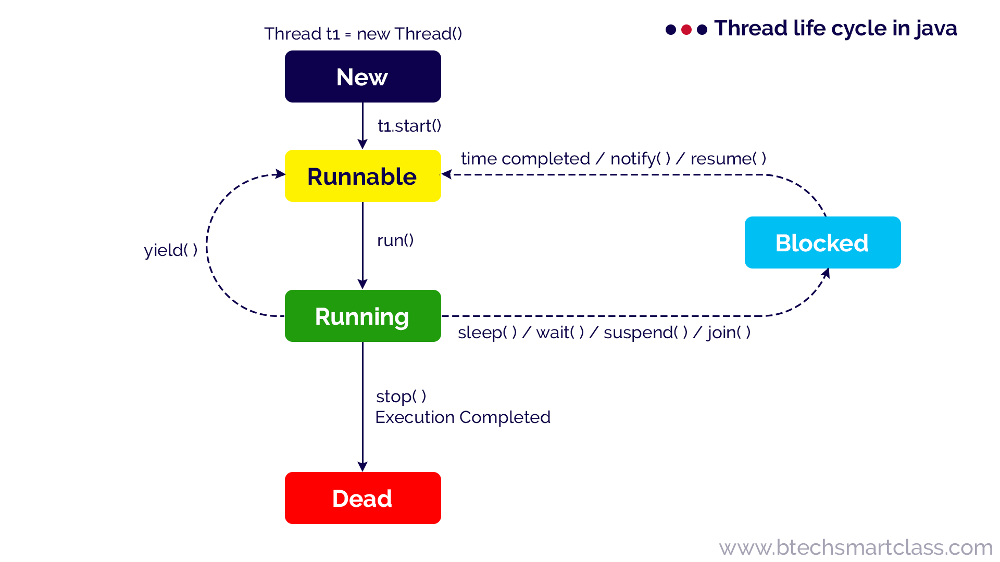

<div class="title-card">
    <h1>Priority</h1>
</div>

---

# Create a simple class that counts to 100

```java
public class CountingThread extends Thread {
    @Override
    public void run() {
        for (int i = 0; i <= 100; i++) {
            System.out.println(Thread.currentThread().getName() + ": " + i);
        }
    }
}
```

---

# In main: Create threads with different priorities

```java
public class MainPriority {

    public static void main(String[] args) throws Exception {
        CountingThread countingThread1 = new CountingThread();
        CountingThread countingThread2 = new CountingThread();
        CountingThread countingThread3 = new CountingThread();

        countingThread1.setPriority(Thread.MAX_PRIORITY);
        countingThread2.setPriority(Thread.MIN_PRIORITY);

        countingThread1.setName("One");
        countingThread2.setName("Two");
        countingThread3.setName("Three");

        countingThread1.start();
        // countingThread1.join();

        countingThread2.start();
        // countingThread2.join();

        countingThread3.start();
    }

}
```

---

# Observe the output

*What happens?*

*What happens if you comment out the first `.join()` call? What about the second?*

---

# Thread Life Cycle in Java

`.join()` blocks execution on the main thread and doesn't proceed to the next line until the thread has finished execution.



[Source](http://www.btechsmartclass.com/java/java-thread-model.html)

---

# Some words about race conditions

What we've observed is that since thread scheduling is handled by JVM we can run into race conditions.

A race condition occurs when the behavior of software depends on the relative timing of events, such as the order in which threads are scheduled to run.

